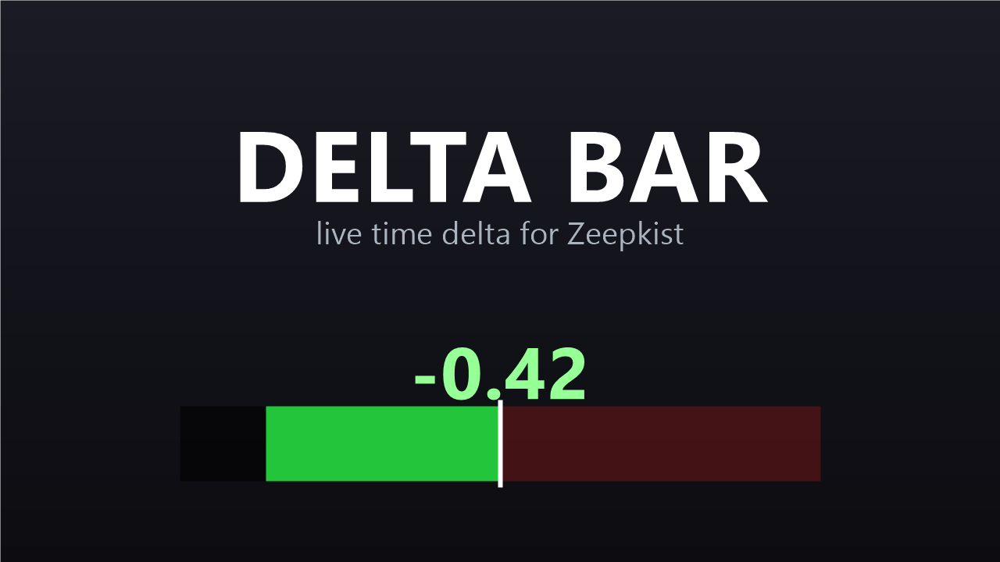

# Delta Bar

A live time-delta overlay for Zeepkist, like the delta bar in Trackmania. While
you drive it shows how far ahead (green) or behind (red) you are versus a
reference run, updated continuously instead of only at checkpoints. It sits just
above the run timer and never touches gameplay. It only reads and draws.

Read-only overlay: no gameplay interference, no network messages, and other
players can join the lobby without the mod. Stays inside the Zeepkist online mod
rules.



## Two modes, picked automatically

- **Level editor:** compares your current run to a recorded trail, either your
  last run or your fastest finished run.
- **Free play and time trial:** compares to your GTR ghost.

The ghost delta is free play only. It is **always disabled in online lobbies**,
the same way GTR only shows ghosts outside lobbies, so it gives no advantage in a
race against other people.

Each mode has its own on/off switch in Zeep Settings (or the config file), so you
can run just the editor delta, just the free play delta, or both. Both are on by
default.

## Editor: last vs fastest

By default it compares to your last run. Switch to your fastest finished run with
the `Reference` setting in Zeep Settings, or in the config file:

```
[Editor]
Reference = Fastest
```

The fastest record clears automatically when you load a different level, and you
can clear it by hand with the `F8` key (rebindable as `ClearRecordKey`).

## Moving the bar

The bar is registered with the ZeepSDK UI configurator, so you move and resize it
the same way as the rest of the HUD: open the configurator (its key is set in
ZeepSDK's settings), cycle to the `DeltaBar` element, and drag or scale it. The
position is saved. By default it sits bottom centre, above the run timer. Set
`Movable = false` under `[Bar]` to go back to the old fixed timer-anchored spot.

## Dependencies

- [Level Editor Trails](https://mod.io/g/zeepkist/m/level-editor-trails) records
  the trails the editor mode compares against.
- [Zeepkist GTR / ZeepCentraal](https://zeepki.st/) provides the ghost for the
  free play mode.

## Build

No .NET SDK needed. The build uses the C# 5 compiler that ships with Windows
(`csc.exe`), driven by `build.bat`. The game must be fully closed before the DLL
is copied, because BepInEx locks it while running. Adjust the paths at the top of
`build.bat` if your Zeepkist install is elsewhere.

## License

MIT, see [LICENSE](LICENSE).
